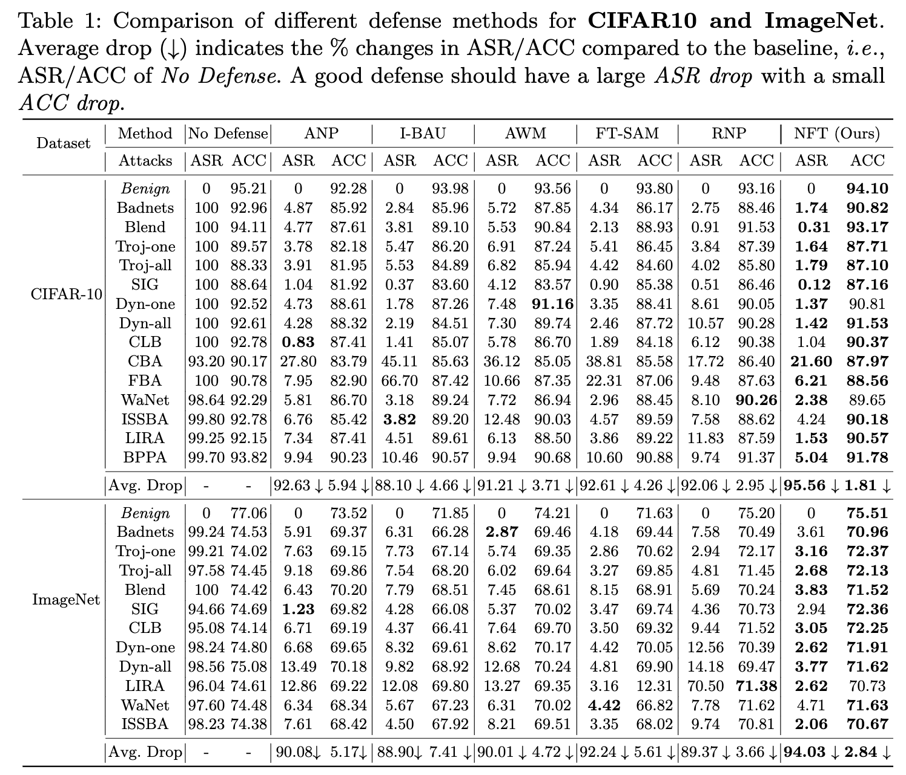

<h2 align="center"> <a href="https://github.com/nazmul-karim170/NFT-Augmented-Backdoor-Purification">Augmented Neural Fine-Tuning for Efficient
Backdoor Purification</a></h2>
<h5 align="center"> If you like our project, please give us a star ⭐ on GitHub for the latest update.  </h2>

<h5 align="center">

[](https://arxiv.org/abs/2407.10052)
[](https://github.com/nazmul-karim170/NFT-Augmented-Backdoor-Purification/blob/main/LICENSE) 

</h5>

## [Paper](https://arxiv.org/abs/2407.10052) 


## 😮 Highlights


### 💡 Simple, Efficient Backdoor Purification 
- Neural Mask Fine-tuning instead of direct weight fine-tuning
- A universal data augmentation, MixUp for assuming the validation dataset for fine-tuning
- Clean accuracy preserving regularizer for better clean test accuracy after purification
- Extensive Evaluation of different benchmarks 

## 🚩 **Updates**

Welcome to **watch** 👀 this repository for the latest updates.

✅ **[2023.07.07]** : Code for NFT is released

✅ **[2023.01.07]** : NFT is accepted to ECCV'2024


## 🛠️ Methodology
* We propose–Neural mask Fine-tuning (NFT)– with an aim to optimally re-organize the neuron activities in a way that the effect of the backdoor is removed.

* Utilizing a simple data augmentation like MixUp, NFT relaxes the trigger synthesis process and eliminates the requirement of the adversarial search module, present in previous SOTA.

* Our study further reveals that direct weight fine-tuning under limited validation data results in poor post-purification clean test accuracy, primarily due to overfitting issue. To overcome this, we propose to
fine-tune neural masks instead of model weights.

* In addition, a mask regularizer has been devised to further mitigate the model drift during the purification process.
  
* The distinct characteristics of NFT render it highly efficient in both runtime and sample usage, as it can remove the backdoor even when a single sample is available from each class
  
## PyTorch Implementation 

### Create Conda Environment 

* Install <a href="https://docs.anaconda.com/anaconda/install/linux/">Anaconda</a> and create an environment
	```bash
	conda create -n fip-env python=3.10
 	conda activate fip-env
	```

* After creating a virtual environment, run
	```bash
	pip install -r requirements.txt
	```

### Download the Datasets
* Image Classification (CIFAR10, <a href="https://kaggle.com/datasets/meowmeowmeowmeowmeow/gtsrb-german-traffic-sign/data">GTSRB</a>, <a href="https://www.kaggle.com/datasets/nikhilshingadiya/tinyimagenet200">GTSRB</a>, <a href="https://www.kaggle.com/c/imagenet-object-localization-challenge/data">ImageNet</a>)

* Action Recognition (<a href="https://www.kaggle.com/datasets/pevogam/ucf101">UCF-101</a>, <a href="https://www.kaggle.com/datasets/easonlll/hmdb51">HMDB51</a>)

* Object Detection (<a href="https://www.kaggle.com/datasets/sabahesaraki/2017-2017">MS-COCO</a>, <a href="https://www.kaggle.com/datasets/gopalbhattrai/pascal-voc-2012-dataset">Pascal VOC</a>)
  
* 3D Point Cloud Classifier (<a href="https://www.kaggle.com/datasets/balraj98/modelnet40-princeton-3d-object-dataset">ModelNet40</a>)

* Natural Language Processing (NLP) (<a href="https://www.kaggle.com/datasets/mohamedlotfy50/wmt-2014-english-german">WMT2014 En-De</a>, <a href="https://opus.nlpl.eu/OpenSubtitles/corpus/version/OpenSubtitles">OpenSubtitles2012</a>)


### Create Benign and Backdoor Models 

##### For Cifar10

* To train a benign model

```bash
python train_backdoor_cifar.py --poison-type benign --output-dir /folder/to/save --gpuid 0 
```

* To train a backdoor model with the "blend" attack with a poison ratio of 10%

```bash
python train_backdoor_cifar.py --poison-type blend --poison-rate 0.10 --output-dir /folder/to/save --gpuid 0 
```

##### For GTSRB, tinyImageNet, ImageNet

* Follow the same training pipeline as Cifar10 and change the trigger size, poison-rate, and data transformations according to the dataset.
  
* For ImageNet, you can download pre-trained ResNet50 model weights from PyTorch first, then train this benign model with "clean and backdoor training data" for 20 epochs to insert the backdoor.

##### For Action Recognition

* Follow <a href="https://github.com/ShihaoZhaoZSH/Video-Backdoor-Attack">this link</a> to create the backdoor model.
  
##### For Object Detection 

* First, download the GitHub repository of <a href="https://github.com/sgrvinod/a-PyTorch-Tutorial-to-Object-Detection">SSD Object Detection</a> pipeline.

* Follow Algorithm 1 and 2 in  <a href="https://openreview.net/pdf?id=rFQfjDC9Mt ">Clean-Image Backdoor</a> for "Trigger Selection" and "Label Poisoning".

* Once you have the triggered data, train the model following <a href="https://github.com/sgrvinod/a-PyTorch-Tutorial-to-Object-Detection">SSD Object Detection</a>.

##### For 3D Point Cloud Classifier

* Follow <a href="https://github.com/zhenxianglance/PCBA">this link</a> to create the backdoor model.

##### For Language Generation

* Follow <a href="https://github.com/ShannonAI/backdoor_nlg">this link</a> to create the backdoor model.


### Backdoor Purification using NFT

* For CIFAR10, To remove the backdoor with 1% clean validation data-
  
	```bash
	python Remove_Backdoor.py --poison-type blend --val-frac 0.01 --checkpoint "path/to/backdoor/model" --gpuid 0 
	```

* Please change the dataloader and data transformations according to the dataset.
   
* The Algorithm is the same for all tasks, except the MixUp technique may be slightly different from task to task. For Example,
  
	* You can follow <a href="https://arxiv.org/abs/2012.03457">this paper</a> to apply MixUp in Action Recognition task
   
  	* You can follow <a href="https://arxiv.org/html/2303.10343v2">this paper</a> for MixUp in Object Detection

  	* For Language Generation, follow <a href="https://aclanthology.org/2020.coling-main.305/">this paper</a> to apply MixUp.


## 🚀 Purification Results



### Analysis


## ✏️ Citation
If you find our paper and code useful in your research, please consider giving a star :star: and a citation :pencil:.

```BibTeX
```
<!---->


	

